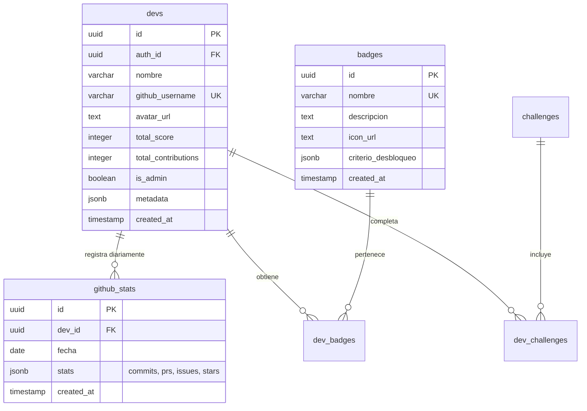

# 🎓 Repo Rivals

> **Plataforma Gamificada de Aprendizaje y Evaluación Docente para Ingeniería en Sistemas**

Repo Rivals es una plataforma web full-stack de alto rendimiento construida con **Bun**, **Hono** y **Supabase**. Está diseñada para docentes y estudiantes de educación superior (universidades, tecnológicos e institutos), permitiendo gamificar el aprendizaje de programación y evaluar la actividad práctica real de los alumnos a través del análisis automatizado de sus aportaciones en **GitHub**.

---

## 📑 Tabla de Contenidos

1. [Características Principales](#-características-principales)
2. [Arquitectura y Tecnologías](#-arquitectura-y-tecnologías)
3. [Estructura del Proyecto](#-estructura-del-proyecto)
4. [Esquema de Base de Datos](#-esquema-de-base-de-datos)
5. [Sistema de Puntuación y Gamificación](#-sistema-de-puntuación-y-gamificación)
6. [Módulo de Periodos Escolares (Docente)](#-módulo-de-periodos-escolares-docente)
7. [Variables de Entorno](#-variables-de-entorno)
8. [Instalación y Puesta en Marcha](#-instalación-y-puesta-en-marcha)
9. [Flujo de Trabajo para Docentes](#-flujo-de-trabajo-para-docentes)
10. [Rutas y Endpoints del Sistema](#-rutas-y-endpoints-del-sistema)

---

## 🚀 Características Principales

### 🏆 1. Ranking Global e Histórico (`/`)
* **Tabla de Posiciones en Tiempo Real:** Ranking de todos los alumnos registrados, ordenable por **Contribuciones Totales**, **Puntos** o **Vista Concentrada**.
* **Ecosistema Tecnológico:** Detección automática de los lenguajes de programación predominantes en los repositorios de los estudiantes (JavaScript, TypeScript, Python, C++, Java, etc.) con gráficos porcentuales.
* **Métricas Globales:** Contadores en vivo de alumnos registrados, contribuciones totales, repositorios públicos y tecnologías activas.

### 📅 2. Control y Evaluación por Periodos Semestrales (`/periodos`)
* **Ciclos Académicos Oficiales:** Soporte nativo para los semestres escolares:
  * **Agosto – Enero** (Semestre de otoño / invierno)
  * **Febrero – Julio** (Semestre de primavera / verano)
* **Detección Inteligente:** Identifica automáticamente el semestre escolar en curso y permite alternar a semestres anteriores con un selector interactivo.
* **Calificación Justa por Periodo:** Filtra y calcula las aportaciones realizadas estrictamente dentro de las fechas de inicio y fin del semestre seleccionado.
* **Indicadores de Desempeño:** Identifica qué alumnos estuvieron *Activos* vs *Sin actividad* en el ciclo.
* **Exportación Docente a Excel/Sheets:** Botón **"📋 Copiar Concentrado (Docente)"** que exporta con un solo clic los datos tabulados al portapapeles para pegarlos directamente en una hoja de cálculo o registro de calificaciones.

### 👤 3. Perfil de Desarrollador (`/dev/:username`)
* **Mapa de Calor de Contribuciones:** Visualizador estilo GitHub interactivo con tooltips por día.
* **Filtro Semestral de Actividad:** Permite al docente alternar entre ver el año corrido (365 días) o la cuadrícula exacta de los 6 meses del semestre evaluado.
* **Desglose de Lenguajes:** Porcentajes y barras de colores de los lenguajes más utilizados por el estudiante.
* **Vitrina de Insignias:** Visualización de logros obtenidos con fecha de desbloqueo y barra de progreso.

### ⚔️ 4. Duelo Comparativo VS (`/duelo-vs`)
* Herramienta para enfrentar y comparar de frente el historial de dos estudiantes seleccionados:
  * Comparación de mapas de calor sincronizados.
  * Análisis de consistencia, commits máximos en un día y promedio diario.

### 🎖️ 5. Sistema de Insignias y Logros
* Motor de reglas dinámicas configurables vía JSONB en base de datos:
  * 🚀 **Hola Mundo:** Primera aportación registrada en el ranking.
  * 🦉 **Ave Nocturna:** Commits realizados después de la medianoche.
  * 🔥 **Constancia Brutal:** Rachas de días seguidos con aportaciones en GitHub.

### ⚙️ 6. Panel y Funciones Administrativas
* **Pre-registro de Alumnos:** El docente puede dar de alta a estudiantes usando únicamente su usuario de GitHub.
* **Sincronización Masiva en Segundo Plano (`/admin/sync-all`):** Actualización paralela de todos los estudiantes mediante GitHub GraphQL sin congelar la interfaz.
* **Gestión de Alumnos:** Sincronización individual y eliminación de usuarios del ranking.

---

## 🛠️ Arquitectura y Tecnologías

| Componente | Tecnología | Descripción |
|---|---|---|
| **Runtime** | [Bun](https://bun.sh/) | Entorno de ejecución JavaScript/TypeScript ultrarrápido con servidor HTTP nativo. |
| **Framework Web** | [Hono](https://hono.dev/) | Framework ligero y de baja latencia con renderizado de componentes JSX del lado del servidor (SSR). |
| **Estilos** | [Tailwind CSS](https://tailwindcss.com/) | Diseño moderno, responsivo con estética Dark Mode (paleta Slate / Emerald). |
| **Base de Datos** | [Supabase](https://supabase.com/) | PostgreSQL con Row Level Security (RLS), triggers automáticos y soporte para JSONB. |
| **Autenticación** | Supabase Auth (OAuth) | Inicio de sesión seguro con GitHub mediante cookies HttpOnly / SameSite. |
| **API de Datos** | GitHub GraphQL API (v4) | Extracción precisa de calendarios de aportaciones, repositorios y lenguajes en una sola consulta. |

---

## 📁 Estructura del Proyecto

```text
reporivals/
├── src/
│   ├── components/
│   │   ├── BadgeShowcase.tsx       # Vitrina interactiva de insignias y medallas
│   │   ├── DevHeatmap.tsx          # Mapa de calor de actividad anual (365 días)
│   │   ├── HeatmapComparator.tsx   # Comparador visual de 2 alumnos en Duelo VS
│   │   ├── Leaderboard.tsx         # Tabla de posiciones principal (Ranking Global)
│   │   ├── PeriodHeatmap.tsx       # Mapa de calor acotado a los 6 meses del semestre
│   │   └── PeriodLeaderboard.tsx   # Tabla de posiciones filtrada por ciclo escolar con exportación
│   ├── utils/
│   │   └── periods.ts              # Lógica de cálculo y catálogo de semestres (Ago-Ene y Feb-Jul)
│   └── index.tsx                   # Servidor principal Hono, rutas HTTP, autenticación y vistas
├── supabase/
│   ├── functions/
│   │   └── sync-github-stats/      # Edge Function para sincronización vía Cron diario
│   ├── migrations/                 # Migraciones SQL históricas
│   └── schema.sql                  # Esquema base de PostgreSQL
├── .env.local                      # Configuración de variables locales (ignorado en Git)
├── package.json                    # Dependencias y scripts de Bun
└── README.md                       # Documentación del proyecto
```

---

## 🗄️ Esquema de Base de Datos

El sistema utiliza PostgreSQL estructurado de forma modular con soporte para métricas flexibles mediante columnas `JSONB`:



---

## 💎 Sistema de Puntuación y Gamificación

Las puntuaciones se calculan automáticamente con base en el impacto de las aportaciones en GitHub:

| Actividad | Puntos Otorgados | Justificación Pedagógica |
|---|---|---|
| **Commit** | `+10 pts` | Valora el trabajo constante y el versionado incremental. |
| **Pull Request (PR)** | `+20 pts` | Fomenta el trabajo colaborativo, integración y revisión de código. |
| **Issue Creado** | `+5 pts` | Incentiva el reporte estructurado de bugs y planeación de requerimientos. |
| **Star Recibida** | `+15 pts` | Reconoce la calidad y utilidad de proyectos públicos ante la comunidad. |

---

## 📅 Módulo de Periodos Escolares (Docente)

A diferencia de los rankings convencionales de código abierto, Repo Rivals incluye un motor de evaluación por semestres diseñado para la academia:

### Reglas de los Ciclos Académicos
1. **Agosto – Enero:**
   * Inicia el **1 de agosto** del año $Y$ y finaliza el **31 de enero** del año $Y+1$.
   * Abarca el ciclo escolar regular de otoño / invierno.
2. **Febrero – Julio:**
   * Inicia el **1 de febrero** del año $Y$ y finaliza el **31 de julio** del año $Y$.
   * Abarca el ciclo escolar de primavera / verano.

### Ventajas para el Profesor
* **Evaluación Aislada:** Un alumno que obtuvo 2,000 puntos en el semestre anterior comenzará desde 0 en el periodo nuevo, permitiendo calificar exclusivamente el desempeño del curso actual.
* **Consulta Histórica:** El docente puede seleccionar semestres de años anteriores para auditorías o aclaración de calificaciones.
* **Copiado Inmediato:** El botón de concentrado copia una tabla tabulada lista para pegar con `Ctrl + V` en Excel, manteniendo nombre, usuario, estado, commits, PRs y puntos.

---

## 🔐 Variables de Entorno

Crea un archivo `.env` o `.env.local` en la raíz del proyecto con la siguiente estructura:

```env
# Supabase Configuration
SUPABASE_URL=https://tu-proyecto.supabase.co
SUPABASE_SERVICE_ROLE_KEY=tu-service-role-key-secreta

# GitHub API Token (Requerido para consultar GraphQL sin límite de tasa)
# Generar en GitHub: Settings -> Developer Settings -> Personal Access Tokens (Tokens Classic)
GITHUB_PAT=ghp_tuTokenDeGitHubPersonal

# Configuración de Servidor (Opcional)
PORT=3000
APP_URL=http://localhost:3000
```

> [!NOTE]
> El token de GitHub (`GITHUB_PAT`) solo requiere permisos de lectura pública de repositorios y perfil (`read:user`, `public_repo`).

---

## 📦 Instalación y Puesta en Marcha

### Prerrequisitos
* Tener instalado [Bun](https://bun.sh/) (v1.0 o superior).
* Una cuenta de [Supabase](https://supabase.com/) con el esquema de base de datos cargado.

### Pasos de Instalación

1. **Clonar el repositorio:**
   ```bash
   git clone https://github.com/Hesiquio/reporivals.git
   cd reporivals
   ```

2. **Instalar dependencias:**
   ```bash
   bun install
   ```

3. **Configurar el entorno:**
   ```bash
   cp .env.example .env
   # Edita .env con tus credenciales de Supabase y GitHub PAT
   ```

4. **Iniciar en modo desarrollo (con Hot Reload):**
   ```bash
   bun run dev
   ```
   La plataforma estará disponible de inmediato en: `http://localhost:3000`

5. **Iniciar en modo producción:**
   ```bash
   bun run start
   ```

---

## 👩‍🏫 Flujo de Trabajo para Docentes

1. **Alta del Alumno:**
   * Si el alumno cuenta con cuenta en GitHub, el docente puede registrarlo desde el panel en `/` ingresando su nombre de usuario de GitHub (ej. `carlosmdev`).
   * Alternativamente, el alumno puede hacer clic en **"Iniciar con GitHub"** y el sistema lo vinculará automáticamente.
2. **Sincronización:**
   * Pulsa el botón **"Sincronizar Todo"** (si eres admin) para traer la actividad histórica y reciente de todos los alumnos en lote.
3. **Seguimiento Semestral:**
   * Entra a la pestaña **"📅 Periodos Escolares"** (`/periodos`).
   * Observa la posición de los estudiantes durante el semestre actual (*Agosto – Enero* o *Febrero – Julio*).
4. **Cierre de Calificaciones:**
   * Al término de la unidad o semestre, pulsa **"📋 Copiar Concentrado (Docente)"**.
   * Abre tu plantilla de Excel y pega los datos directamente para obtener el puntaje y desglose de commits de cada estudiante.

---

## 🌐 Rutas y Endpoints del Sistema

### Vistas Principales (HTML SSR)
* `GET /` — Tablero principal con Ranking Global, estadísticas de proyectos, ecosistema de tecnologías y panel de pre-registro admin.
* `GET /periodos` — Panel docente con selector de ciclos escolares (Agosto-Enero / Febrero-Julio), métricas de alumnos y exportación a Excel.
* `GET /mi-perfil` — Panel de perfil institucional (adapta campos automáticamente para Alumnos o Docentes, con auto-capitalización de nombres).
* `POST /mi-perfil` — Guardado seguro de datos institucionales (carrera ISC/IIAR, generación, No. Control o adscripción docente).
* `GET /dev/:username` — Perfil individual del desarrollador con mapa de calor anual o semestral y vitrina de insignias.
* `GET /duelo-vs` — Comparador directo entre 2 desarrolladores seleccionados.
* `GET /sobre-nosotros` — Misión, identidad institucional para Sistemas e Inteligencia Artificial y vitrina demostrativa.

### Autenticación
* `GET /auth/login` — Redirección a GitHub OAuth mediante Supabase.
* `GET /auth/callback` — Callback de autenticación y establecimiento de sesión por cookies.
* `GET /auth/logout` — Cierre de sesión y limpieza de cookies.
* `GET /auth/sync-profile` — Sincronización manual de la cuenta del usuario autenticado.

### Panel de Administración
* `POST /admin/add-dev` — Pre-registra un estudiante o docente seleccionando su rol y carrera.
* `GET /admin/toggle-role/:id` — Alterna con 1 solo clic entre el rol de Docente (`👨‍🏫`) y Estudiante (`🎓`) directamente desde el ranking.
* `GET /admin/delete-dev/:id` — Elimina a un dev del ranking.
* `GET /admin/sync-dev/:id` — Fuerza la sincronización de un dev específico.
* `GET /admin/sync-all` — Sincroniza en segundo plano a todos los desarrolladores registrados.

### API
* `POST /api/sync` — Endpoint para automatización vía Webhook o Cron Job externo para sincronizar a todos los alumnos.

---

## 📚 Memoria Técnica y Documento de Respaldo

Para conocer a fondo todos los detalles de arquitectura, bitácora cronológica de requerimientos y la guía paso a paso para restaurar el proyecto en un nuevo equipo o sistema operativo, consulta:

👉 **[`docs/CONTEXTO_PROYECTO_COMPLETO.md`](docs/CONTEXTO_PROYECTO_COMPLETO.md)**

---

## 📄 Licencia

Este proyecto fue desarrollado con ❤️ para la carrera de **Ingeniería en Sistemas Computacionales** usando **Hono** & **Bun**.
Distribuido bajo la Licencia MIT. Consulta el archivo `LICENSE` para más detalles.
